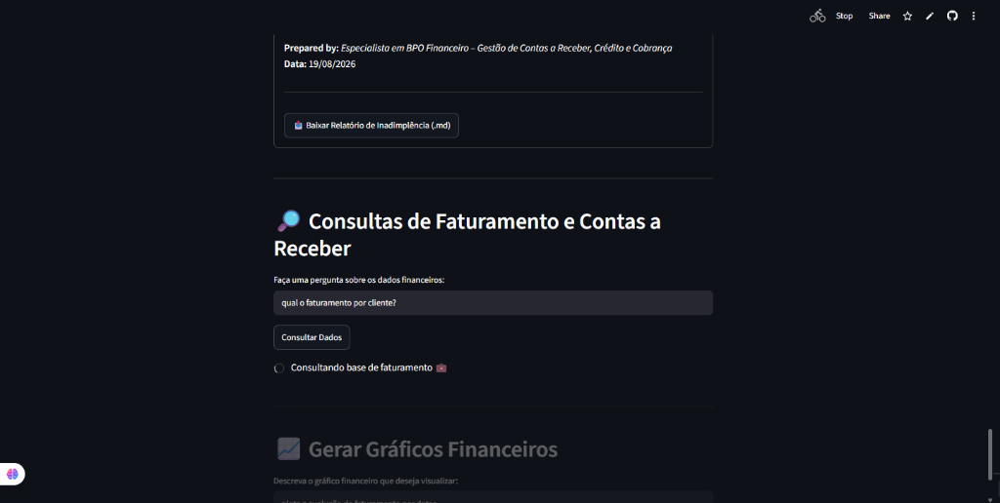
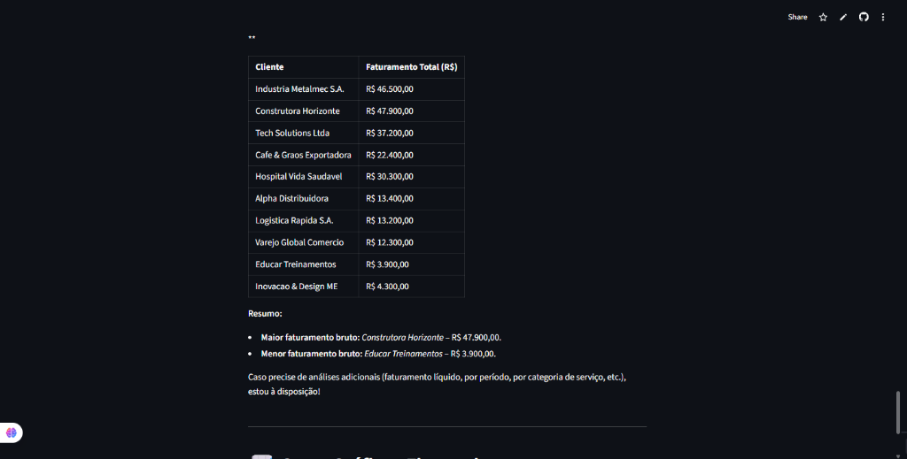
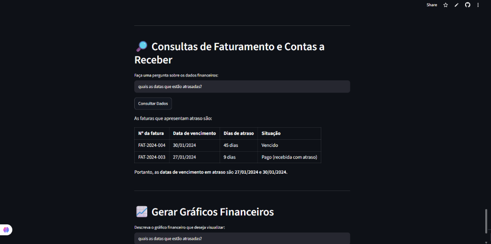
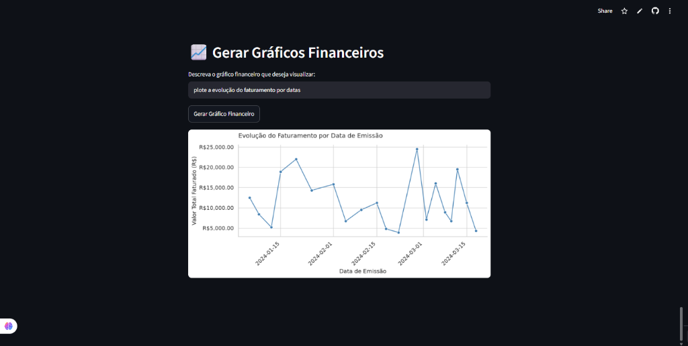

# 💼 Assistente de BPO Financeiro & Faturamento com IA

<div align="center">

[](https://projetolangchainagentsia.streamlit.app)
[](https://share.streamlit.io/user/denilson-silva-de-almeida)
[](https://www.python.org/)
[](https://www.langchain.com/)
[](https://groq.com/)
[](https://opensource.org/licenses/MIT)

**Transforme planilhas financeiras brutas em diagnósticos executivos, controle de inadimplência, gráficos de BI e insights em linguagem natural.**

🔗 **Acesse o aplicativo online:** [projetolangchainagentsia.streamlit.app](https://projetolangchainagentsia.streamlit.app)  
👤 **Perfil do desenvolvedor no Streamlit:** [share.streamlit.io/user/denilson-silva-de-almeida](https://share.streamlit.io/user/denilson-silva-de-almeida)

</div>

---

## 📌 Sumário

- [Visão Geral](#-visão-geral)
- [Acesso Online (Nuvem)](#-acesso-online-nuvem)
- [Demonstração Visual e Como Funciona (Guia Didático)](#-demonstração-visual-e-como-funciona-guia-didático)
  - [1. Relatórios Executivos em 1 Clique](#1-relatórios-executivos-em-1-clique)
  - [2. Consultas em Linguagem Natural](#2-consultas-em-linguagem-natural)
  - [3. Geração Dinâmica de Gráficos Financeiros](#3-geração-dinâmica-de-gráficos-financeiros)
- [Documentos e Relatórios Gerados](#-documentos-e-relatórios-gerados)
- [Arquitetura e Tecnologias](#-arquitetura-e-tecnologias)
- [Estrutura do Projeto](#-estrutura-do-projeto)
- [Formato Recomendado dos Dados (CSV)](#-formato-recomendado-dos-dados-csv)
- [Guia de Instalação Local](#-guia-de-instalação-local)
  - [1. Pré-requisitos](#1-pré-requisitos)
  - [2. Clonando o Repositório](#2-clonando-o-repositório)
  - [3. Ambiente Virtual e Dependências](#3-ambiente-virtual-e-dependências)
  - [4. Configuração do `.env`](#4-configuração-do-env)
  - [5. Execução](#5-execução)
- [Boas Práticas e Segurança](#-boas-práticas-e-segurança)
- [Autor e Contato](#-autor-e-contato)
- [Licença](#-licença)

---

## 🚀 Visão Geral

Na rotina de **BPO Financeiro**, controladoria e gestão de faturamento, equipes perdem horas preciosas consolidando planilhas no Excel, calculando prazos de vencimento e tentando entender quem está devendo.

Este assistente atua como um **consultor financeiro com IA**:
1. Você faz o upload de uma planilha de faturamento (`.csv`).
2. Com **1 clique**, o sistema gera relatórios executivos com diagnósticos completos de faturamento e contas a receber.
3. Você pode **conversar com a sua planilha em português**, tirando dúvidas financeiras pontuais com respostas 100% calculadas via Python/Pandas.
4. Você pode solicitar **gráficos sob demanda**, gerados na hora para apresentações e tomada de decisão.

---

## 🌐 Acesso Online (Nuvem)

Você pode testar e utilizar o assistente diretamente no navegador, sem precisar instalar nada na sua máquina:

👉 **[Clique aqui para abrir o Assistente no Streamlit Cloud](https://projetolangchainagentsia.streamlit.app)**

> 💡 *Conheça também outros projetos no meu perfil oficial do Streamlit:*  
> 👉 **[Perfil no Streamlit Cloud - Denilson Silva de Almeida](https://share.streamlit.io/user/denilson-silva-de-almeida)**

---

## 📸 Demonstração Visual e Como Funciona (Guia Didático)

Abaixo, veja como o assistente funciona na prática, para que serve cada botão e o que significa cada resultado gerado:

---

### 1. Relatórios Executivos em 1 Clique

Em vez de cruzar tabelas manualmente, o assistente possui dois botões inteligentes principais:

* 📊 **Botão "Relatório de Faturamento & Receita":**
  * **Para que serve?** Dá um raio-X de tudo o que a empresa faturou. Mostra o valor total faturado (bruto e líquido), o valor médio de cada venda (*ticket médio*), os impostos retidos e avisa se há dados faltando na planilha.
* 🚨 **Botão "Relatório de Inadimplência & Aging":**
  * **Para que serve?** Analisa a carteira de contas a receber e aponta exatamente quem está com pagamento atrasado, há quantos dias está atrasado (*Aging List*) e sugere uma régua de cobrança estratégica para recuperar o dinheiro sem desgastar o relacionamento com o cliente.

#### 🖥️ Resultado na Tela com Download em Markdown (`.md`):

Após o processamento da IA, o relatório executivo é formatado com visual formal e oferece o botão para **baixar o arquivo completo**:



> **O que você vê na imagem:** O relatório foi gerado por um agente especialista em contas a receber e crédito, permitindo a leitura detalhada no painel e o download imediato (`.md`) para anexar em e-mails ou despachos de diretoria.

---

### 2. Consultas em Linguagem Natural

Você não precisa decorar fórmulas de Excel (`SOMASE`, `PROCV`) nem entender de programação. Basta digitar a sua dúvida em português no campo de busca.

#### 🔹 Exemplo A: Faturamento Total por Cliente
Quando você pergunta *"qual o faturamento por cliente?"*, o agente agrupa os valores de cada empresa, formata em moeda brasileira (`R$`) e cria um resumo com o maior e o menor faturamento:



> **O que você vê na imagem:** A tabela lista as receitas consolidadas de cada cliente (como *Construtora Horizonte* com R$ 47.900,00 e *Indústria Metalmec* com R$ 46.500,00) e conclui com os destaques da carteira.

---

#### 🔹 Exemplo B: Identificação de Títulos e Datas em Atraso
Quando você pergunta *"quais as datas que estão atrasadas?"*, a IA faz uma varredura nas datas de vencimento e nos dias de atraso para isolar os títulos pendentes:



> **O que você vê na imagem:** A IA lista as faturas com pendência (ex: *FAT-2024-004* vencida há 45 dias) e aponta claramente as datas que exigem ação da equipe de cobrança.

---

### 3. Geração Dinâmica de Gráficos Financeiros

Uma imagem vale mais do que milhares de linhas de planilha. Quando você pede um gráfico, a IA escreve e executa o código visualmente na hora com **Matplotlib** e **Seaborn**.

#### 🔹 Exemplo: Evolução do Faturamento ao Longo do Tempo
Ao solicitar *"plote a evolução do faturamento por datas"*, o sistema gera um gráfico de linhas corporativo:



> **O que você vê na imagem:** O gráfico de linhas ilustra os picos e quedas de faturamento ao longo das datas de emissão, facilitando a identificação de sazonalidades e períodos de maior entrada de caixa.

---

## 📑 Documentos e Relatórios Gerados

O repositório já inclui exemplos reais de diagnósticos gerados pelo assistente prontos para consulta:

1. 📄 **[relatorio_faturamento_receita.md](relatorio_faturamento_receita.md)**:
   - Indicadores de faturamento bruto (R$ 231.400,00) e líquido (R$ 211.555,00).
   - Ticket médio e dispersão de valores.
   - Auditoria cadastral e fiscal de campos nulos e duplicidades.
   - Recomendações práticas de BPO Financeiro.

2. 📄 **[relatorio_inadimplencia_aging.md](relatorio_inadimplencia_aging.md)**:
   - Diagnóstico da carteira de recebíveis.
   - Faixas de atraso do *Aging List* (0-30 dias, 31-60 dias, >90 dias).
   - Índice de inadimplência e cobertura de caixa.
   - Régua de cobrança preventiva e medidas corretivas.

---

## 🛠️ Arquitetura e Tecnologias

```
  ┌─────────────────────────────────────────────────────────────┐
  │                    Streamlit Web Interface                  │
  │     (Upload CSV, Métricas, Ações Rápidas, Chat & Gráficos)   │
  └──────────────────────────────┬──────────────────────────────┘
                                 │
                                 ▼
  ┌─────────────────────────────────────────────────────────────┐
  │               LangChain ReAct Agent Executor                │
  │           (Prompt Especializado em Finanças & BPO)          │
  └──────────────────────────────┬──────────────────────────────┘
                                 │
         ┌───────────────────────┼──────────────────────┐
         ▼                       ▼                      ▼
┌──────────────────┐   ┌───────────────────┐  ┌───────────────────┐
│  Relatórios BPO  │   │ PythonAstREPLTool │  │  Gerador Gráfico  │
│ (Groq LLM Chain) │   │ (Cálculos Pandas) │  │(Seaborn/Matplot)  │
└──────────────────┘   └───────────────────┘  └───────────────────┘
```

- **Interface:** [Streamlit](https://streamlit.io/)
- **Orquestração de Agentes:** [LangChain](https://www.langchain.com/) / LangChain Groq / LangChain Community
- **Modelo de IA:** [Groq Cloud](https://groq.com/) (execução ultrarrápida de modelos de linguagem)
- **Manipulação de Dados:** [Pandas](https://pandas.pydata.org/) & [NumPy](https://numpy.org/)
- **Visualização Gráfica:** [Matplotlib](https://matplotlib.org/) & [Seaborn](https://seaborn.pydata.org/)
- **Segurança de Variáveis:** [python-dotenv](https://pypi.org/project/python-dotenv/)

---

## 📁 Estrutura do Projeto

```plaintext
projeto-langchain/
├── App.py                            # Aplicação web Streamlit e orquestrador do agente
├── ferramentas.py                    # Ferramentas de Relatórios, Gráficos e consultas Python
├── requirements.txt                  # Dependências e bibliotecas Python
├── assets/                           # Capturas de tela e evidências visuais de uso
│   ├── 01_relatorio_executivo.png
│   ├── 02_consulta_faturamento_cliente.png
│   ├── 03_consulta_titulos_atrasados.png
│   └── 04_grafico_evolucao_faturamento.png
├── faturamento_exemplo.csv           # Planilha de faturamento de exemplo para testes
├── relatorio_faturamento_receita.md  # Relatório de Faturamento gerado pela IA
├── relatorio_inadimplencia_aging.md  # Relatório de Inadimplência gerado pela IA
├── .env                              # Chave da API Groq (não versionado)
└── .gitignore                        # Regras de exclusão do Git
```

---

## 📄 Formato Recomendado dos Dados (CSV)

O assistente foi desenhado para ser flexível com diferentes cabeçalhos, mas você pode se basear no arquivo [faturamento_exemplo.csv](faturamento_exemplo.csv) já incluído no repositório:

| Coluna | Tipo | Descrição |
|---|---|---|
| `numero_fatura` | Texto | Identificador único da nota fiscal / fatura |
| `data_emissao` | Data (`YYYY-MM-DD`) | Data de emissão da cobrança |
| `data_vencimento` | Data (`YYYY-MM-DD`) | Data limite para pagamento |
| `data_pagamento` | Data (`YYYY-MM-DD`) | Data do pagamento efetivo (ou vazio se pendente) |
| `cliente` | Texto | Nome da empresa tomadora do serviço |
| `categoria_servico`| Texto | Centro de custo ou categoria do serviço prestado |
| `valor_bruto` | Numérico | Valor total faturado antes das retenções |
| `impostos` | Numérico | Valor total de tributos retidos |
| `valor_liquido` | Numérico | Valor líquido a receber em conta |
| `forma_pagamento` | Texto | Forma de cobrança (`PIX`, `Boleto`, `Cartao`, etc.) |
| `status_pagamento` | Texto | Situação da duplicata (`Pago`, `Pendente`, `Vencido`) |
| `dias_atraso` | Inteiro | Número de dias de atraso após a data de vencimento |

---

## ⚙️ Guia de Instalação Local

Caso deseje rodar o projeto localmente no seu computador:

### 1. Pré-requisitos
- Python 3.10 ou superior instalado.
- Chave de API gratuita da [Groq Console](https://console.groq.com/keys).

### 2. Clonando o Repositório
```bash
git clone https://github.com/Denilson-Silva-de-Almeida/projeto-langchain.git
cd projeto-langchain
```

### 3. Ambiente Virtual e Dependências

**No Windows (PowerShell):**
```powershell
python -m venv .venv
.venv\Scripts\Activate.ps1
pip install -r requirements.txt
```

**No Linux / macOS:**
```bash
python3 -m venv .venv
source .venv/bin/activate
pip install -r requirements.txt
```

### 4. Configuração do `.env`
Crie um arquivo `.env` na pasta raiz e adicione sua chave da Groq:
```env
GROQ_API_KEY=gsk_sua_chave_groq_aqui
```

### 5. Execução
Inicie a aplicação com:
```bash
streamlit run App.py
```
O navegador abrirá automaticamente em `http://localhost:8501`.

---

## 🔐 Boas Práticas e Segurança

- **Segurança de Credenciais:** As chaves de API nunca devem ser expostas publicamente. O projeto suporta variáveis de ambiente locais (`.env`) e os Secrets seguros do Streamlit Cloud (`st.secrets`).
- **Ambiente de Execução Python Controlado:** O executor `PythonAstREPLTool` atua exclusivamente no escopo do DataFrame carregado (`df`), garantindo isolamento e segurança.

---

## 👤 Autor e Contato

Desenvolvido por **Denilson Silva de Almeida**.

- 🌐 **Streamlit Community:** [share.streamlit.io/user/denilson-silva-de-almeida](https://share.streamlit.io/user/denilson-silva-de-almeida)
- 💼 **Projeto em Produção:** [projetolangchainagentsia.streamlit.app](https://projetolangchainagentsia.streamlit.app)
- 🐙 **GitHub:** [github.com/Denilson-Silva-de-Almeida](https://github.com/Denilson-Silva-de-Almeida)

---

## 📜 Licença

Distribuído sob a licença **MIT**. Veja o arquivo `LICENSE` para mais detalhes.

---

<div align="center">
  <sub>Desenvolvido com foco em produtividade, automação e inteligência financeira para BPO.</sub>
</div>
